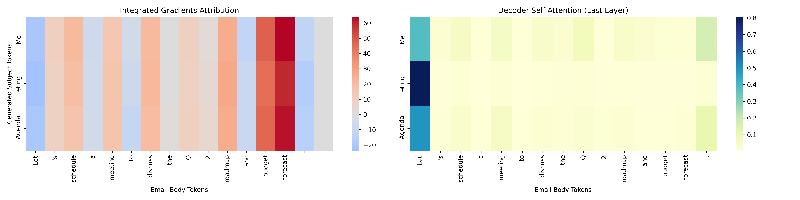

# 📧 Explainable GPT-2 for Email Subject Line Generation

This project fine-tunes a GPT-2 model to generate subject lines from email bodies using the [AESLC](https://huggingface.co/datasets/Yale-LILY/aeslc) dataset. It further pursues **Explainable AI** by visualizing both attention and attribution to help understand model behavior.

---

## 🚀 Project Goals

- **Input:** Realistic email bodies (from AESLC dataset)
- **Output:** A concise subject line summarizing the email
- **Explainability:** Use both *Integrated Gradients* and *Attention Visualization* to interpret predictions

---

## 🧠 Model Training

- **Base model:** `gpt2` from HuggingFace Transformers
- **Training objective:** causal language modeling (`email_body + "\nSubject:" → subject_line`)
- **Data:** 12,000 samples from AESLC for training
- **Fine-tuning:** Done using Huggingface's `Trainer`

Example format:
Question (input): Let's schedule a meeting to discuss the roadmap.\nSubject:
Answer (target): Meeting Agenda

---

## 📊 Decoding Strategies Evaluation

We compare different decoding strategies to evaluate the quality and diversity of generated subject lines:

- `Greedy decoding`
- `Top-k sampling (k=50)`
- `Top-p (nucleus) sampling (p=0.9)`

A test script compares the model's generations against the ground-truth titles on the last 100 samples of the dataset, and saves results in `decoding_comparison.csv`.

---

## 🔍 Explainability Module

### ✅ Integrated Gradients

- Highlights which input tokens most influenced a particular output token.
- Generates token-to-token **attribution heatmaps**.

### ✅ Attention Visualization

- Extracts GPT-2’s final-layer self-attention for each generated token.
- Visualizes which parts of the email body were attended to when generating each token.

### ✅ Dual Heatmap Output

- Integrated Gradients + Attention Side-by-side
- Example:
  

---

## 📁 Key Files

| File | Description |
|------|-------------|
| `train.py` | GPT2 training on AESLC |
| `evaluate_decoding_strategies.py` | Run inference on 100 samples with multiple decoding strategies |
| `explain_dual_heatmap.py` | Generate dual heatmap of attention and attribution for a given sample |
| `decoding_comparison.csv` | Output file with decoding results |
| `explain_meeting_agenda_dual.png` | Example heatmap visualization |

---

## 🧪 Example Result

