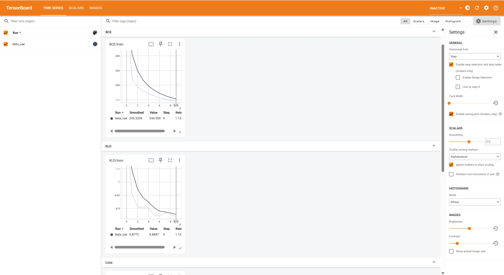
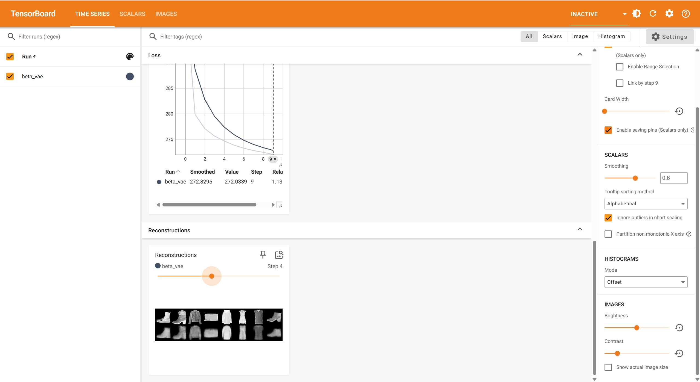
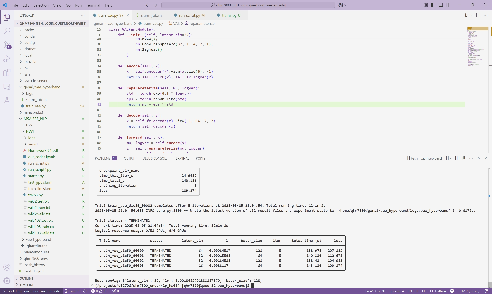

# VAE from Scratch for Fashion Image Generation

 
**Summary:** Learn a clean latent representation of Fashion‑MNIST with a **Variational Autoencoder (VAE)** (and its β‑VAE variant) and generate realistic fashion images.  
## Scaled MLOps Pipeline (📦 data → 🧠 model → 💾 checkpoints)

| Stage | Location (file) | What’s inside |
|-------|-----------------|---------------|
| **Data loading** | `train_vae.py` | Reads Fashion‑MNIST, applies transforms, wraps in `DataLoader` |
| **Model definition** | `model.ipynb` | Builds both vanilla VAE and β‑VAE modules in PyTorch |
| **Training loop** | `train_vae.py` | Runs forward‑pass, computes BCE + KL (or β*KL), back‑prop, and logs metrics |
| **Checkpoint save / load** | `train_vae.py` | Writes model parameters to file each epoch |
| **Hyperparameter tuning** | `train_vae.py` + `ray` | Ray Tune explores latent dim, learning rate, batch size and store results |
| **Experiment tracking** | `beta_vae_tsb.py` + TensorBoard | Script copies images/metrics into `runs/`; view with `tensorboard --logdir runs` |
| **Cluster execution** | `slurm_job.sh` | Single‑line submit (`sbatch`) sets up environment and launches Ray sweep on SLURM. |

> **Why it matters:** these pieces turn a classroom demo into a **repeatable experiment pipeline**—you can stop/restart jobs, sweep hyper‑parameters at scale, and visualise progress in real time.

---

## Dataset

> **Fashion‑MNIST** (Zalando Research) – 70 000 28×28 grayscale images across 10 clothing classes (T‑shirt, trouser, sneaker, …).  

---

## Model Architecture

| Part        | Layer(s) | Notes |
|-------------|----------|-------|
| **Encoder** | Conv (1→32, 3×3) → ReLU → Conv (32→64, 3×3) → ReLU → Flatten → FC → **μ**, **log σ²** | |
| **Latent**  | 32‑D vector sampled via reparameterization trick | Latent dim swept over {16, 32, 64} |
| **Decoder** | FC → reshape → ConvT (64→32) → ReLU → ConvT (32→1) → Sigmoid | |
| **Loss**    | **Binary Cross‑Entropy** + **KL‑divergence** | β‑VAE multiplies KL by β |

---

## Repository Structure

```text
vae_hyperband/
├── checkpoints/           # Auto‑saved model & Ray Tune checkpoints
├── logs/                  # TensorBoard event files
├── best_config.png        # Visualised best hyperparams
├── beta_vae_tsb.py        # Quick TB launch for β‑VAE runs
├── model.ipynb            # Notebook: VAE + β‑VAE definition & demo
├── slurm_job.sh           # Sample SLURM script (Ray on a cluster)
├── tensorboard1.png       # Loss / KL curves
├── tensorboard2.png       # Generated samples over epochs
└── train_vae.py           # Main entry – Ray Tune HPO + training loop
```


---
## TensorBoard
asdf



---
## Best_config


---


